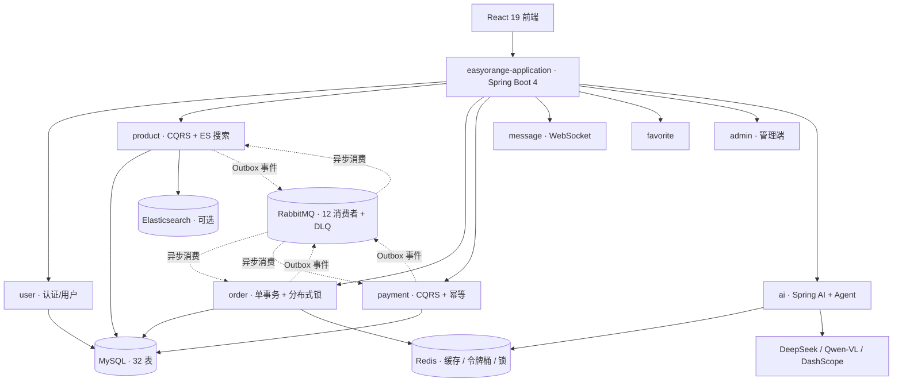

# EasyOrange — LLM × DDD：Java 架构工程化实战

> **EasyOrange** — 在 DDD 六边形架构里集成 LLM：AI 链路**可换供应商、可降级、可观测**的工程化实战项目。
>
> **11 模块解耦 · 44 Port 编译期隔离 · 12 事件消费者 · 11 条 ADR · 2,400+ 测试守卫 · AI 6 决策点 × 8 项工程化**
>
> 业务载体：C2C 资产流转（固定价格 + 直发 + 平台不碰货），把复杂度留给架构与 AI 工程化。

[](LICENSE)
[](https://openjdk.java.net/)
[](https://spring.io/projects/spring-boot)
[](https://react.dev/)

## 两条技术主线

EasyOrange 在两条技术主线上都有独立且完整的落地，可分别展开讲解：

| AI 应用工程化 | 架构落地 |
|---|---|
| **Spring AI 2.0 框架化** — 6 决策点直接注入 `ChatModel` / `EmbeddingModel` bean，切换供应商只改配置不改业务代码（[ADR-0008](doc/adr/0008-ai-spring-ai-framework.md)） | **DDD 六边形 + CQRS** — 44 Port 编译期隔离，domain 层零框架依赖；CQRS 仅 product / order / payment / message 4 模块（[ADR-0002](doc/adr/0002-cqrs-scope-4-modules.md)） |
| **轻量级 Agent 编排** — `AiSearchEnhancer` 4 路并行 Tool Calling，整体 5s 超时后保留已完成步骤，无 LangChain4j 黑盒 | **拒绝 Saga** — 订单创建本地单事务 + Redisson 分布式锁防超卖 + Outbox 事件副作用（[ADR-0007](doc/adr/0007-order-local-tx-over-saga.md)） |
| **限流 / 预算 / 降级** — Redisson 分布式令牌桶（超限 429）+ 供应商故障 stale 兜底 + `@TokenBudget` 日预算 AOP | **事件驱动可靠投递** — Spring Modulith Outbox → RabbitMQ → DLQ 三级重试 + traceId 全链路 |
| **Prompt 工程化** — 8 个 YAML 模板版本化渲染（6 决策点 + 2 对话） | **架构治理** — ArchUnit 12 条规则守卫分层 + 11 条 ADR 记录决策 |
| **Embedding 真实现 + 多模态** — text-embedding-v3 kNN + BM25 混合检索 + Qwen-VL 拍照识别自动上架 | **质量门禁** — 2,400+ 测试（JaCoCo 行覆盖 + PIT 变异测试双重验证），前端 Biome 0 errors |

## 业务边界（刻意聚焦）

业务场景的复杂度是主动收敛的——把精力留给架构与 AI 工程化：

| 维度 | 聚焦决策 | 原因 |
|---|---|---|
| 价格机制 | **固定价格** | 议价 / 阶梯降价会引入复杂状态机，侵蚀架构主线 |
| 物流模式 | **C2C 直发** | 平台不碰货、不囤货，物流走资产方 → 认领方 |
| 资金流 | **不经手资金** | 规避支付牌照、备付金等合规复杂度；支付仅是「记账 + 状态推进」 |
| 商业模式 | **业务聚焦核心流程** | 复杂度留给架构与 AI 工程化 |

> 「资产」是广义概念，不局限于二手实物：实物（数码 3C / 图书 / 服饰）+ 虚拟数字资产（会员 / 游戏账号 / 素材）+ 权益类（健身卡 / 课程兑换码）。平台不议价、不持有库存，资产方按固定价格上架。

## 架构总览



- **前端**：React 19 SPA，C 端 + 管理端（暖橙指挥中心设计系统）双布局
- **后端**：Spring Boot 4 聚合 11 个 Maven 模块，DDD 六边形 + CQRS 分层
- **数据**：MySQL（Flyway 迁移）+ Redis（缓存 / 令牌桶 / 分布式锁 / 会话）+ Elasticsearch（可选，BM25 + kNN）
- **消息**：Spring Modulith Outbox → RabbitMQ Topic Exchange，12 个事件消费者，DLQ 三级重试
- **AI**：DeepSeek（Chat）/ Qwen-VL（Vision）/ DashScope（Embedding），统一 OpenAI 兼容协议

> 更完整的组件级架构见 [doc/架构/架构-系统架构.md](doc/架构/架构-系统架构.md)。

### 事件驱动：Outbox → RabbitMQ → DLQ

领域事件与应用事务**同原子**写入 `EVENT_PUBLICATION` → 异步 externalize 到 RabbitMQ Topic Exchange → 每个消费者独占队列 + `EventIdempotencyChecker` 精确一次 → 失败进队列级 DLQ（`DlqRetryScheduler` 5 分钟重投 <3 次，毒消息转储 `eo.dlq.terminal`）。审计日志同样走 Outbox。traceId 经 Brave → MDC → MQ header 全链路传递。详见 [doc/agents/架构参考.md](doc/agents/架构参考.md)「后端架构核心原则」。

### 订单创建（拒绝 Saga）

下单在单一本地 `@Transactional` 内完成（订单 / 扣库存 / 支付 / Outbox 原子提交），Redisson 分布式锁按 productId 排序防死锁防超卖；任一步失败整体回滚，**无补偿路径**。取消 / 退款 / 完成等跨模块副作用由订单生命周期事件异步触发。详见 [ADR-0007](doc/adr/0007-order-local-tx-over-saga.md)。

## AI 应用工程化

### 核心矛盾与解法

DDD 铁律要求 domain 层零框架依赖，但 LLM 调用昂贵且不稳定。解法：**AI 基础设施全面框架化为 Spring AI 2.0**（[ADR-0008](doc/adr/0008-ai-spring-ai-framework.md)）——6 个业务服务直接注入 `ChatModel` / `EmbeddingModel` bean（DeepSeek + Qwen-VL + DashScope，统一 OpenAI 兼容协议），供应商可换只改配置；业务级治理保留：令牌桶限流、`@TokenBudget` 日预算、Prompt YAML 版本化。

### 6 个 AI 决策点

| 侧 | 决策点 |
|---|---|
| **资产方** | 智能估值 / AI 营销文案 / AI 信用画像 |
| **认领方** | AI 智能找货 / AI 物品评估 / AI 信用画像 |

### 轻量级 Agent 编排

[`AiSearchEnhancerAdapter`](./easyorange-backend/easyorange-ai/src/main/java/com/cartethyia/easyorange/ai/adapter/outbound/AiSearchEnhancerAdapter.java) 基于 Spring AI 手写轻量 Agent Planner：4 路 Tool Calling（LLM 意图识别 / 商品标签生成 / 市场分析 / 建议问题生成），`CompletableFuture` 虚拟线程并行，整体 5s 超时（`allOf().get(5s)`，无单步超时）后收集已完成步骤的部分结果，无 LangChain4j 黑盒。

### AI 对话 / RAG 完整链路 / 评估闭环（2026-08-14 扩展）

- **多轮 Agent 对话**（[`AiChatService`](./easyorange-backend/easyorange-ai/src/main/java/com/cartethyia/easyorange/ai/application/service/AiChatService.java)）：Redis 会话短期记忆 + `eo_user_preference` 画像长期记忆 + 单步 ReAct 工具决策；**SSE 流式**（`/api/ai/chat/stream`，事件协议 token/sources/done/error），前端 Playground 打字机效果
- **RAG 完整链路**（[`KnowledgeIngestionService`](./easyorange-backend/easyorange-ai/src/main/java/com/cartethyia/easyorange/ai/application/service/KnowledgeIngestionService.java)）：文档摄入管线（分块 500+overlap50 → embed → ES `knowledge_docs` 索引，启动补索引）+ kNN+BM25 混合召回 → Java Cosine 重排 → [来源:标题] 引用溯源
- **评估进 CI**：30 条金标准集（`eval/golden-set.yaml`）+ LLM-as-Judge 对照参考打分 + `EvalGate` 门禁（低于基线 4.0-0.3 卡 build，nightly `ai-eval.yml` 注入真实 key 定时执行）+ hit@5/MRR 检索指标 + 👍/👎 反馈飞轮自动扩充评测集
- **成本治理**：语义缓存（余弦相似度命中复用，阈值 0.92）+ 模型路由（场景 → bean 配置）

### AI 工程化 8 件套

框架化 / Embedding 真实现 / 令牌桶限流（超限 429）/ 供应商故障 stale 兜底 / TokenBudget / Prompt YAML 版本化 / 多模态 Vision / 4 路并行 Tool Calling。完整机制见 [doc/集成/AI-资产管理.md](doc/集成/AI-资产管理.md)。

## 架构治理

> 设计理念：不是列「我用了什么」，而是讲「我评估过什么、为什么不用」。

| 层 | 机制 | 解决的问题 |
|---|---|---|
| **决策层** | 11 条 ADR（[doc/adr/](doc/adr/)） | 记录「为什么 + 拒绝项」，不让选型沦为偏好 |
| **守卫层** | ArchUnit 12 条规则（[`ArchitectureRulesTest`](./easyorange-backend/easyorange-application/src/test/java/com/cartethyia/easyorange/architecture/ArchitectureRulesTest.java)） | CI 阻断违规：domain 零框架 / CQRS 读写分离 / 模块间端口隔离 / 端口必有适配器 / 禁止 infrastructure 包 |
| **验证层** | JaCoCo + PIT 变异测试 | JaCoCo 看「代码跑过」，PIT 注入变异看「测试能否发现缺陷」 |

### 拒绝项清单

| 被拒绝方案 | 原因 | 替代方案 | ADR |
|---|---|---|---|
| 2PC / XA / Seata AT | 强一致锁表久 + 连接池代理侵入 | 本地单事务 + Redisson 分布式锁 + Outbox | [ADR-0007](doc/adr/0007-order-local-tx-over-saga.md) |
| Saga 编排（跨模块补偿） | 单库下补偿与回滚重复、失败状态随事务回滚丢失 | 本地单事务 + 分布式锁 + Outbox | [ADR-0007](doc/adr/0007-order-local-tx-over-saga.md) |
| 全模块 CQRS | user / favorite / ai 等读写比均衡或调用外部 API，收益 < 维护成本 | 仅 product / order / payment / message 4 模块 | [ADR-0002](doc/adr/0002-cqrs-scope-4-modules.md) |
| LangChain4j | Tool 调用反射黑盒 + 升级兼容差 | 手写 AiSearchEnhancer 4 路 Tool 编排 | [ADR-0008](doc/adr/0008-ai-spring-ai-framework.md) |
| Milvus / PGVector | SKU < 10 万，向量库 ROI 低 | ES BM25 召回 + LLM semantic rerank（RAG 轻量版） | 隐含决策 |
| Kafka / Pulsar 默认 MQ | Kafka 无原生 DLQ；1 事件 → 12 消费者模型不匹配；Pulsar 本地太重 | RabbitMQ Topic Exchange + 队列级 DLQ | [ADR-0005](doc/adr/0005-messaging-rabbitmq.md) |

## 模块结构

| 模块 | DDD 角色 | 核心定位 |
|---|---|---|
| **application** | 启动聚合层 | 主入口、Flyway、跨模块适配器、ArchUnit 守卫 |
| **common** | 通用基础 | 统一响应体 / 异常 / 领域事件接口 / 工具 |
| **framework** | 框架适配层 | Security（双 Token）/ Redis / MyBatis / RabbitMQ / 限流 / 审计 AOP |
| **user** | 业务限界上下文 | 认证（双 Token）、用户资料、信用分 |
| **product** | 业务限界上下文 | 商品（CQRS）+ 审核 / 举报 + ES 搜索 + 语义检索 |
| **order** | 业务限界上下文 | 订单（CQRS）+ 单事务 + 分布式锁 + 生命周期事件 |
| **payment** | 业务限界上下文 | 支付（CQRS）+ 幂等 + Mock 网关 |
| **message** | 业务限界上下文 | 消息（CQRS）+ 站内信 + WebSocket / STOMP 实时沟通 |
| **favorite** | 业务限界上下文 | 收藏 + 批量校验 |
| **ai** | 业务限界上下文 | Spring AI 框架化 + Agent 编排 + 令牌桶 / 预算 / Prompt |
| **admin** | 管理端边界 | 后台 API（用户 / 商品审核 / 订单 / 举报 / 统计） |

## 技术栈

| 层 | 技术 |
|---|---|
| **后端** | Java 25 · Spring Boot 4 · MyBatis-Plus · MapStruct |
| **安全** | Spring Security OAuth2 Resource Server · **双 Token**：RSA 签名 Access（30min 无状态）+ Opaque Refresh（Redis SHA-256，HttpOnly Cookie，轮换 + 复用检测）· BCrypt |
| **前端** | React 19 · TypeScript · Vite · TanStack Query 5 · Zustand 5 · Tailwind 4 · shadcn/ui · Biome |
| **数据 / 消息** | MySQL 8.4 · Redis 8 · RabbitMQ 4.3 · Elasticsearch 9.2（可选） |
| **AI** | Spring AI 2.0 · DeepSeek · Qwen-VL · DashScope Embedding |
| **可靠性** | Redisson（分布式锁 / 令牌桶）· Spring Modulith Outbox · CacheErrorHandler fail-open |
| **可观测** | Micrometer + Prometheus · Brave（traceId）· Spring AI Observation · 结构化日志 |
| **DevOps** | Docker / docker-compose · GitHub Actions · Flyway 13 |

## 快速开始

```bash
git clone https://github.com/Xytheria-t/EasyOrange.git && cd easy-orange
docker compose -f compose.yaml up -d                               # MySQL / Redis / RabbitMQ
cd easyorange-backend && ./mvnw install -DskipTests && ./mvnw spring-boot:run -pl easyorange-application   # :8080
cd easyorange-frontend && npm install && npm run dev               # :5173

# 压测 / 多实例 / 可观测（详见 doc/工程指标.md §2.3；fullstack profile 下裸 up -d 不受影响）
docker compose --profile fullstack up -d --build --scale easyorange-app=2  # 后端多实例（nginx 自动 LB）
docker compose up -d prometheus grafana                                    # Prometheus :9090 + Grafana :3000
k6 run --vus 50 --duration 30s load-tests/product-list.js                  # k6 压测（阈值 p95<500ms 内置）
```

> 零配置启动：全部变量在 `application*.yaml` / `compose.yaml` 内都有开发默认值，**不建 `.env` 也能启动**；需要覆盖默认值时复制 `.env.example` → `.env`（Docker Compose 自动读取；终端 JVM 需 `set -a; source .env; set +a`）。完整命令（PIT 变异测试、JaCoCo、OWASP、E2E）见 [doc/agents/常用命令.md](doc/agents/常用命令.md)。

## 文档地图

| 资源 | 内容 |
|---|---|
| [AGENTS.md](./AGENTS.md) | 唯一规范来源：定位 / 项目结构 / 技术栈 / 硬约束 / 参考索引（细分内容见 [doc/agents/](doc/agents/)） |
| [DATABASE.md](doc/DATABASE.md) | 数据库全局约定、表清单与迁移脚本索引（字段级结构以迁移脚本为准） |
| [doc/工程指标.md](doc/工程指标.md) | 测试数 / 覆盖率单一事实来源（2,400+ 为取整下限） |
| [doc/架构/](doc/架构/) | 架构规范（系统架构 / DDD / 安全认证 / 数据库迁移 / 部署） |
| [doc/集成/](doc/集成/) | 业务专题（AI 资产管理 / API 速查） |
| [doc/adr/](doc/adr/) | 11 条架构决策记录 |

## 项目结构

```
easy-orange/
├── easyorange-backend/     # Spring Boot 后端（11 Maven 模块，DDD 六边形）
├── easyorange-frontend/    # React 前端（C 端 + 管理端）
├── doc/                    # 架构 / 集成 / ADR / 面试
├── compose.yaml            # MySQL + Redis + RabbitMQ + 后端应用（多实例）+ Prometheus + Grafana
├── infra/                  # 基础设施即代码（Prometheus / Grafana provisioning / ES IK 镜像）
├── k8s/                    # K8s 部署（kustomize，无状态应用层）
├── load-tests/             # k6 压测脚本
└── .claude/rules/ecc/      # AI 编码规则（ECC）
```

## 贡献与许可

- **贡献**：Conventional Commits · `main / develop / feature/* / bugfix/*`，见 [CONTRIBUTING.md](./.github/CONTRIBUTING.md)
- **安全**：漏洞报告见 [SECURITY.md](./.github/SECURITY.md)
- **许可**：MIT License

---

<div align="center">

**EasyOrange** · LLM × DDD：Java 架构工程化实战 · Java 25 + Spring Boot 4 · DDD + CQRS + 本地单事务/分布式锁 + 事件驱动 + AI 工程化 · [GitHub](https://github.com/Xytheria-t/EasyOrange)

</div>
